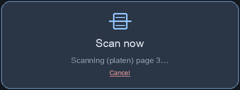
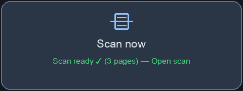
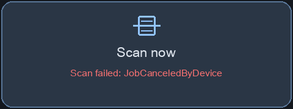

# eSCL Scan for Home Assistant

A Home Assistant custom integration that triggers document scans on any
eSCL/AirScan-capable network scanner and surfaces **per-job state** through
a sensor — including live page progress for ADF batches, completion,
cancellation, and the scanner's own error reasons.

Ships with a companion Lovelace card so a "Scan now" tile on your dashboard
is a single tap.

> 💡 **Sister project:** for printing PDFs to the same multifunction
> printers, see [**ha-ipp-print**](https://github.com/wleonhardt/ha-ipp-print)
> — same architecture (per-job sensor + Lovelace card + bus events) targeting
> IPP/IPPS instead of eSCL.

<p align="center">
  
  
  <br/>
  
  
</p>

## Why this exists

Home Assistant's built-in printer integrations (`brother`, `ipp`, the various
HACS HP/Epson components) are all **read-only** — they poll device status
sensors but cannot trigger scans. The only existing HACS scan-trigger
integration is Brother-DCP-1610W-specific and produces a single JPEG via
WSD SOAP. Nothing in the ecosystem targets eSCL, even though eSCL is the
vendor-neutral standard that nearly every modern multifunction device
supports (HP, Canon, Epson, modern Brother, Kyocera, Xerox, …).

`escl_scan` talks eSCL directly:

- `ScannerStatus` to probe and detect ADF vs Platen source
- `ScanJobs` (POST) to create a job with a `ScanSettings` envelope
- `ScanJobs/{uuid}/NextDocument` (GET) to pull each page as the scanner produces it
- `ScanJobs/{uuid}` (DELETE) to cancel

Job state flows into `sensor.printer_current_scan` (state + filename
+ pages_done + source + timestamps), and
`escl_scan_state_changed` / `escl_scan_completed` events fire on the bus so
you can wire up automations (mobile notifications with the PDF attached,
auto-upload to Paperless, etc.).

## Features

- 📄 Direct eSCL submission — no SANE, no CUPS, no driver layer
- 🔍 Auto-discovered via mDNS (`_uscan`/`_uscans`) — shows up under *Discovered*
- 📚 Multi-page ADF batches merged into one PDF (per-page scanners included)
- 📐 Full-bed scan region and duplex from the device's own `ScannerCapabilities`
- 📊 Per-scan sensor (`sensor.printer_current_scan`) with live page progress
- 🔘 `button.<scanner>_scan_now` entity + `escl_scan.start` / `escl_scan.cancel` services for automations
- 🔔 Bus events for state changes and completion
- 🛑 Cancel-Job support
- 🎨 Lovelace card with one-tap scan and status display
- 🔒 Bearer-token authenticated file download endpoint
- ⚙️ Config flow — no YAML required
- 🔑 Works with the legacy ciphers some HP LaserJets ship with (opt-in)

## Requirements

- Home Assistant 2024.8 or newer
- A network scanner that supports eSCL / AirScan (most modern MFPs do)
- The scanner reachable from your HA host (typically port 443 or 80)

## Installation

### Via HACS (custom repository)

1. HACS → Integrations → ⋮ → Custom repositories
2. Add `https://github.com/wleonhardt/ha-escl-scan` as type **Integration**
3. Install **eSCL Scan**
4. Restart Home Assistant

### Manual

1. Copy `custom_components/escl_scan/` into your `<config>/custom_components/` directory
2. Restart Home Assistant

## Setup

Most eSCL scanners advertise themselves on the LAN, so the scanner usually
appears under **Settings → Devices & Services → Discovered**; press
*Configure*, confirm, done. Credentials and TLS settings can be adjusted
afterwards in the integration's options.

For manual setup: **Settings → Devices & Services → Add Integration → eSCL Scan**
and fill in:

| Field | Notes |
|---|---|
| Hostname or IP | e.g. `scanner.local` or `192.168.1.50` |
| Port | `443` for HTTPS (default), `80` for HTTP |
| Use TLS | On for HTTPS |
| User | Only required if scanner uses basic auth |
| Password | Only required if scanner uses basic auth |
| Verify TLS | Off for self-signed certs (most consumer scanners) |
| Allow legacy cipher suites | Enable if you see `SSLV3_ALERT_HANDSHAKE_FAILURE` in the logs |

The flow does a quick eSCL `ScannerStatus` probe before saving — any 200
response confirms the network/auth path works. It then reads
`ScannerCapabilities` (best-effort) for the model name, serial number, bed
size per source, duplex support, and the supported resolutions:

- the scan region is the full bed of the chosen source (A4, Letter, Legal
  ADF — whatever the device reports), so nothing gets cropped;
- a requested DPI the device doesn't offer snaps to the nearest supported one;
- duplex is only sent for Feeder scans on a duplex-capable ADF.

Options (gear icon on the integration) hold the defaults: DPI, color mode,
duplex, and file retention.

## Adding the card to a dashboard

The integration registers the card globally — no `resources:` block needed.

```yaml
type: custom:escl-scan-card
title: Scan now        # optional, defaults to "Scan now"
entity: sensor.printer_current_scan   # optional; auto-detected if renamed
```

## Services and button

For automations, use the services instead of the REST API (no token needed):

```yaml
# Scan the ADF in grayscale, both sides, and grab the resulting scan_id
action: escl_scan.start
data:
  source: Feeder      # optional: Platen | Feeder (auto-detected if omitted)
  dpi: 300            # optional, snaps to a supported resolution
  color: gray         # optional: color | gray
  duplex: true        # optional, Feeder + duplex ADF only
response_variable: scan

# Cancel the current scan (or pass scan_id: ...)
action: escl_scan.cancel
```

`escl_scan.start` returns the same dict the sensor exposes as attributes
(`scan_id`, `source`, `dpi`, `state`, …). A `button.<scanner>_scan_now`
entity is created too, so a stock *Tile* or *Button* card works without the
custom card.

### Example: notify with the PDF when a scan completes

```yaml
triggers:
  - trigger: event
    event_type: escl_scan_completed
conditions:
  - condition: template
    value_template: "{{ trigger.event.data.state == 'completed' }}"
actions:
  - action: notify.mobile_app_phone
    data:
      message: "Scan ready: {{ trigger.event.data.pages_done }} page(s)"
      data:
        url: "{{ trigger.event.data.file_url }}"
```

## Sensor + events

`sensor.printer_current_scan`

| Field | Value |
|---|---|
| state | `idle` / `pending` / `processing` / `processing-stopped` / `canceled` / `aborted` / `completed` / `failed` |
| attributes.scan_id | Internal scan id (matches the file endpoint) |
| attributes.filename | Auto-generated filename (e.g. `scan-20260524-153012-adf.pdf`) |
| attributes.pages_done | Pages pulled from the scanner so far (final PDF page count on completion) |
| attributes.source | `Platen` or `Feeder` |
| attributes.duplex | `true` when both sides were requested (Feeder + duplex ADF only) |
| attributes.state_reasons | The scanner's eSCL `JobStateReasons` |
| attributes.submitted_at / finished_at | ISO timestamps |
| attributes.file_url | Download URL once complete (`/api/escl_scan/file/{id}`) |
| attributes.file_path | Absolute path of the stored PDF once complete (for `shell_command`, Paperless uploads, …) |
| attributes.copied_to | Path of the copy made by *copy to folder*, if enabled |

Bus events you can trigger automations from:

- `escl_scan_state_changed` — every observed state change
- `escl_scan_completed` — once per terminal transition (completed / canceled / aborted)

Both carry the full scan dict as `event.data`.

## REST API

The integration registers three HA HTTP views (all `requires_auth = true`):

### `POST /api/escl_scan/start`

Optional JSON body to override defaults: `{"dpi": 600, "color": "gray", "source": "Feeder", "duplex": true}`. Returns:

```json
{"ok": true, "scan_id": "abc123", "source": "Feeder", "dpi": 600, "color": "gray", "duplex": true, "state": "pending"}
```

Returns `409` if a scan is already running — the scanner is single-job
hardware, so starts are serialized.

### `POST /api/escl_scan/cancel`

JSON body `{"scan_id": "abc123"}`. Returns `{"ok": true}` on success.

### `GET /api/escl_scan/file/{scan_id}`

Streams the PDF. Returns 404 if the scan isn't complete yet or has been
TTL-purged.

## Scan to folder (Paperless-ngx etc.)

Options → *Also copy finished scans to this folder*. Every completed scan is
copied there (written under a temp name and renamed, so folder watchers never
see a half-written file). Point it at a Paperless-ngx consume directory and
scans become documents with no automation at all. The folder must be listed
in `configuration.yaml`:

```yaml
homeassistant:
  allowlist_external_dirs:
    - /media/paperless/consume
```

Copies are never purged by the retention TTL.

## Troubleshooting

- **Download diagnostics** (device page → ⋮ → *Download diagnostics*) and
  attach it to bug reports: it contains the parsed `ScannerCapabilities`,
  the current/tracked scans, and redacted entry data.
- **Debug logging:**
  ```yaml
  logger:
    logs:
      custom_components.escl_scan: debug
  ```
- **`SSLV3_ALERT_HANDSHAKE_FAILURE`** → enable *Allow legacy cipher suites*.
- **Scan fails with "truncated PDF"** → the DPI/colour combination isn't
  supported; with capabilities available the DPI snaps automatically, so
  try a different colour mode.
- **"scanner busy"** → another client (phone, PC) has an active job; wait
  or cancel it on the device.
- **Card shows "Configuration error" briefly on a slow reload** → expected,
  the card self-heals within a few seconds.

## Caveats

- **No OCR.** Scans land as image-mode PDFs. Pair with Paperless-ngx or an
  OCR-capable bus-event listener for searchable text.
- **1h TTL on stored PDFs** by default (configurable in options; a periodic
  sweep purges expired files even when no new scan runs).
- **One scanner, one scan at a time.** The integration allows a single config
  entry, and a start request while a scan is in progress is rejected (`409`)
  rather than clobbering the running job.
- **HP LaserJets**: some models only offer non-PFS TLS ciphers. Enable
  "Allow legacy cipher suites" in the config flow.

## Development

```
custom_components/escl_scan/
├── __init__.py        # entry setup, HTTP views, card registration
├── config_flow.py     # UI flow + options flow
├── coordinator.py     # scan lifecycle driver + file retention
├── const.py
├── manifest.json
├── scanner.py         # eSCL wire format + client
├── sensor.py          # sensor.printer_current_scan
├── static/card.js     # the Lovelace card
├── strings.json
└── translations/en.json
```

### Tests

```
pip install -r requirements-test.txt
pytest -q            # parser, coordinator lifecycle, scanner, config-flow tests
ruff check custom_components tests
```

Pull requests welcome.

## License

MIT
