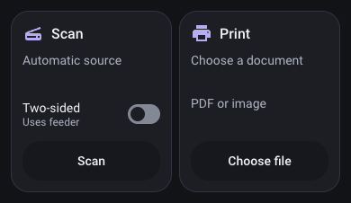

# eSCL Scan for Home Assistant

[](https://github.com/hacs/default)
[](https://github.com/wleonhardt/ha-escl-scan/releases)
[](https://github.com/wleonhardt/ha-escl-scan/actions/workflows/validate.yml)
[](LICENSE)

A Home Assistant custom integration that triggers document scans on
eSCL/AirScan-capable network scanner and surfaces **per-job state** through
a sensor — including live page progress for ADF batches, completion,
cancellation, and the scanner's own error reasons.

Ships with a companion Lovelace card with a Scan action, a compact Two-sided
switch and live progress.

> 💡 **Sister project:** for printing PDFs to the same multifunction
> printers, see [**ha-ipp-print**](https://github.com/wleonhardt/ha-ipp-print)
> — same architecture (per-job sensor + Lovelace card + bus events) targeting
> IPP/IPPS instead of eSCL.

<p align="center">
  
</p>

## Why this exists

Home Assistant's built-in printer integrations (`brother`, `ipp`, the various
HACS HP/Epson components) are all **read-only** — they poll device status
sensors but cannot trigger scans. The only existing HACS scan-trigger
integration is Brother-DCP-1610W-specific and produces a single JPEG via
WSD SOAP. Nothing in the ecosystem targets eSCL, even though eSCL is the
vendor-neutral standard that nearly every modern multifunction device
supports (HP, Canon, Epson, modern Brother, Kyocera, Xerox, …).

`escl_scan` talks eSCL directly:

- `ScannerStatus` to probe and detect ADF vs Platen source
- `ScanJobs` (POST) to create a job with a `ScanSettings` envelope
- `ScanJobs/{uuid}/NextDocument` (GET) to pull each page as the scanner produces it
- `ScanJobs/{uuid}` (DELETE) to cancel

Job state flows into `sensor.printer_current_scan` (state + filename
+ pages_done + source + timestamps), and
`escl_scan_state_changed` / `escl_scan_completed` events fire on the bus so
you can wire up automations (mobile notifications with the PDF attached,
auto-upload to Paperless, etc.).

## Features

- 📄 Direct eSCL submission — no SANE, no CUPS, no driver layer
- 🔍 Auto-discovered via mDNS (`_uscan`/`_uscans`) — shows up under *Discovered*
- 📚 Multi-page ADF batches merged into one PDF (per-page scanners included)
- 📐 Full-bed scan region and duplex from the device's own `ScannerCapabilities`
- 📊 Per-scan sensor (`sensor.printer_current_scan`) with live page progress
- 🔘 `button.<scanner>_scan_now` entity + `escl_scan.start` / `escl_scan.cancel` services for automations
- 🔔 Bus events for state changes and completion
- 🛑 Cancel-Job support
- 🎨 Lovelace card with one-tap scan and status display
- 🔒 Bearer-token authenticated file download endpoint
- ⚙️ Config flow — no YAML required
- 🔑 Works with the legacy ciphers some HP LaserJets ship with (opt-in)

## Requirements

- Home Assistant 2024.12 or newer (2026.3+ for the integration icon)
- A network scanner that supports eSCL / AirScan (PDF, JPEG or PNG acquisition required)
- The scanner reachable from your HA host (typically port 443 or 80)

### Tested devices

| Device | Platen | ADF | Duplex | Notes |
|---|---|---|---|---|
| HP Color LaserJet MFP M283fdw | ✅ | ✅ | n/a (simplex ADF) | Discovered via mDNS; capabilities, DPI snap, cancel, copy-to-folder verified live on HA 2026.9.1 |

Works with yours? Open a [device report](https://github.com/wleonhardt/ha-escl-scan/issues/new?template=device_report.yml)
and it gets added here.

## Installation

### Via HACS (default store)

[](https://my.home-assistant.io/redirect/hacs_repository/?owner=wleonhardt&repository=ha-escl-scan&category=integration)

HACS → search **eSCL Scan** → Download → restart Home Assistant. No custom
repository needed.

### Manual

1. Copy `custom_components/escl_scan/` into your `<config>/custom_components/` directory
2. Restart Home Assistant

## Setup

Most eSCL scanners advertise themselves on the LAN, so the scanner usually
appears under **Settings → Devices & Services → Discovered**; press
*Configure*, confirm, done. Credentials and TLS settings can be adjusted
afterwards in the integration's options.

For manual setup: **Settings → Devices & Services → Add Integration → eSCL Scan**
and fill in:

| Field | Notes |
|---|---|
| Hostname or IP | e.g. `scanner.local` or `192.168.1.50` |
| Port | `443` for HTTPS (default), `80` for HTTP |
| Scanner resource path | `eSCL` normally; a bridge may advertise another path. `/` uses its root |
| Use TLS | On for HTTPS |
| User | Only required if scanner uses basic auth |
| Password | Only required if scanner uses basic auth |
| Verify TLS | Off for self-signed certs (most consumer scanners) |
| Allow legacy cipher suites | Enable if you see `SSLV3_ALERT_HANDSHAKE_FAILURE` in the logs |

The flow does a quick eSCL `ScannerStatus` probe before saving — any 200
response confirms the network/auth path works. It then reads
`ScannerCapabilities` (best-effort) for the model name, serial number, bed
size per source, duplex support, and the supported resolutions:

- the scan region is the full bed of the chosen source (A4, Letter, Legal
  ADF — whatever the device reports), so nothing gets cropped;
- a requested DPI snaps to the nearest supported resolution for the chosen
  source, color and simplex/duplex profile, using discrete values or square ranges;
- automatic duplex is only sent for Feeder scans on a duplex-capable ADF.
  A two-sided request on a simplex ADF, or when capabilities are unavailable,
  uses the manual workflow below.

Options (gear icon on the integration) hold the defaults: DPI, color mode,
duplex, rotating duplex back sides 180° (for ADFs that feed them reversed),
and file retention.

## Adding the card to a dashboard

The integration registers the card as a dashboard resource automatically — no
`resources:` block needed. It also injects the module globally as a fallback
for YAML resource configurations.

```yaml
type: custom:escl-scan-card
title: Scan            # optional, defaults to "Scan"
entity: sensor.printer_current_scan   # optional; auto-detected if renamed
duplex: false          # optional; initial Two-sided setting
```

Set **Two-sided**, then press **Scan** for a two-sided feeder document. The
switch only changes the next scan; it never starts one. Off explicitly requests
one-sided scanning, while on selects the feeder. The card's `duplex` default
overrides the integration's duplex default; DPI and color still use integration
defaults unless changed in Options. The switch remembers changes while the card stays mounted and resets
on reload. Settings are locked while a scan is starting, running or awaiting
download. With fresh scanner capabilities, the card shows **Automatic duplex**
or **Two passes required**. Unknown/stale support retains **may need two passes**;
the printer's ability to print double-sided does not imply duplex scanning.

After completion, the main action becomes **Download PDF**. It stays available
after the scanner returns to idle and switches back to **Scan** once the PDF
has been handed to your browser's download handler. A failed download can be
retried; an expired file offers Scan again. The browser controls saving the file
and does not report whether you cancel its save dialog. The result is retained
only in the current card instance; reloading the dashboard, changing its scanner
or starting a newer scan elsewhere can replace it. Persistent history is planned.

Both scan and print cards inherit the dashboard theme's surface and shape. Add
them directly to a Sections view for automatic sizing, or keep an existing
horizontal stack. See [paired Sections example](examples/dashboard-sections.yaml).
Explicit titles and existing card types continue to work. Long scan conflicts
show a short summary that expands to recovery details.

Automatic duplex
is used when advertised by the scanner. Otherwise, the card scans the fronts
and pauses with reload instructions. **Wait for the reload prompt before
flipping**; some scanners keep the first job open after sheets leave the
feeder and will consume any pages reloaded early into that same pass.
Reload with backs facing the scanner and
choose their feed order: **First sheet first** when keeping the same sheet
order, or **Last sheet first (flipped stack)** when flipping the whole stack
reverses its order. Then choose **Scan back sides**. The default is first sheet
first; the integration uses your selection rather than inferring page order.
The final PDF is ordered front 1, back 1, front 2, back 2, and so on.

Both passes must contain the same number of pages. A mismatch fails the scan
without publishing a partial document. You can cancel while waiting; the
reload window expires after 15 minutes. Fronts are held privately until the
backs succeed. A scanner failure during automatic duplex is reported as a
failure; it is not silently retried after sheets have already been consumed.

Automations can watch for `awaiting-back-sides`, then call
`escl_scan.scan_backs` after the user reloads the backs. Optional `scan_id`
selects the waiting scan; omitted `scan_id` uses the current scan. Set
`reverse_back_order: true` when the last sheet feeds first (default `false`).

## Scan options and compatibility

Open **Options** (the sliders icon) for Source, Color, Resolution and Page size.
Options open in a theme-aware dialog, so a narrow Sections tile stays compact.
Choose Automatic, Feeder or Glass; Glass cannot scan both sides. Resolution
choices follow the known source/color profiles, and adjustments are explained.
Full scan area means the advertised maximum region, not automatic paper detection.
Letter/A4 or Custom can avoid unnecessary blank space; custom dimensions in the
card use millimeters. The service/API uses integer 1/300-inch units.

Card defaults are optional: `source: auto` (`Platen` for Glass or `Feeder`),
`color: default` (`color` or `gray`), `dpi: 300` and `page_size: full`
(`letter` or `a4`). `duplex_in_options: true` moves the Two-sided switch into
Options. Edits during a job apply to the next job. Download and reload/back-order
controls retain their existing behavior.

Native PDF is preferred. JPEG/PNG-only profiles are converted to PDF with Pillow,
provided by Home Assistant core. Each encoded image is limited to
50 MiB and 40 megapixels after decoding; lower DPI or page size if necessary.
Asymmetric-only resolutions, TIFF and multi-frame images are not supported.
Unknown format metadata retains the legacy PDF request; it is not proof of support.

See the [compatibility and bridge guide](docs/compatibility.md) for evidence levels,
optional AirSane/ipp-usb routes, diagnostic collection and remaining hardware gates.

## Services and button

For automations, use the services instead of the REST API (no token needed):

```yaml
# Scan the ADF in grayscale, both sides, and grab the resulting scan_id
action: escl_scan.start
data:
  source: Feeder      # optional: Platen | Feeder (auto-detected if omitted)
  dpi: 300            # optional, snaps to a supported resolution
  color: gray         # optional: color | gray
  duplex: true        # optional, Feeder: automatic duplex or manual fallback
response_variable: scan

# Cancel the current scan (or pass scan_id: ...)
action: escl_scan.cancel
```

`escl_scan.start` returns the same dict the sensor exposes as attributes
(`scan_id`, `source`, `dpi`, `state`, …). A `button.<scanner>_scan_now`
entity is created too, so a stock *Tile* or *Button* card works without the
custom card.

### Example: notify with the PDF when a scan completes

```yaml
triggers:
  - trigger: event
    event_type: escl_scan_completed
conditions:
  - condition: template
    value_template: "{{ trigger.event.data.state == 'completed' }}"
actions:
  - action: notify.mobile_app_phone
    data:
      message: "Scan ready: {{ trigger.event.data.pages_done }} page(s)"
      data:
        url: "{{ trigger.event.data.file_url }}"
```

## Connection and recovery

The integration adds a native **Connection** binary sensor to its device. It is
unknown until the first check, connected when the protocol answers successfully,
and disconnected when it cannot be reached. This does not promise paper, ink,
or readiness: a stopped printer may still be reachable. Job `idle` is separate.
Checks run every 60 seconds, back off to at most five minutes after failures, and
have a ten-second deadline. No test document or scan is created by these checks.
The job sensor also exposes `device_connection` with `state`, `checked_at`,
`last_success_at` and `next_check_at`; the card marks stale evidence as unconfirmed.
Use the native sensor in a Tile card for a dashboard connection summary.

The cards recover current integration-tracked jobs from Home Assistant state
when mounted or reconnected. They disable actions during a lost HA connection,
keep the active device fixed, and never automatically replay a request. A print
file staged in one card remains local to that card. Tracking is still in memory:
restarting HA or reloading the integration does not recover past jobs. Durable
scan results and activity history are a later phase.

## Sensor + events

`sensor.printer_current_scan`

| Field | Value |
|---|---|
| state | `idle` / `pending` / `processing` / `processing-stopped` / `awaiting-back-sides` / `canceled` / `aborted` / `completed` / `failed` |
| attributes.scan_id | Internal scan id (matches the file endpoint) |
| attributes.filename | Auto-generated filename (e.g. `scan-20260524-153012-adf.pdf`) |
| attributes.pages_done | Pages pulled from the scanner so far (final PDF page count on completion) |
| attributes.source | `Platen` or `Feeder` |
| attributes.duplex | `true` when both sides were requested (Feeder + duplex ADF only) |
| attributes.duplex_mode | `simplex`, `automatic`, or `manual` |
| attributes.scan_phase | Manual workflow: `fronts`, `waiting-for-backs`, or `backs` |
| attributes.front_pages | Validated front-side page count in a manual scan |
| attributes.reverse_back_order | Whether the manual back-side pass was loaded last sheet first |
| attributes.state_reasons | The scanner's eSCL `JobStateReasons` |
| attributes.submitted_at / finished_at | ISO timestamps |
| attributes.file_url | Download URL once complete (`/api/escl_scan/file/{id}`) |
| attributes.file_path | Absolute path of the stored PDF once complete (for `shell_command`, Paperless uploads, …) |
| attributes.copied_to | Path of the copy made by *copy to folder*, if enabled |

Bus events you can trigger automations from:

- `escl_scan_state_changed` — every observed state change
- `escl_scan_completed` — once per terminal transition (completed / canceled / aborted)

Both carry the full scan dict as `event.data`.

## REST API

The integration registers five HA HTTP views (all `requires_auth = true`):

### `GET /api/escl_scan/capabilities?entity_id=sensor.printer_current_scan`

Returns schema version 1, the resolved sensor, bounded model identity, supported
sources and per-source `Platen` / `Feeder` / `FeederDuplex` profiles, automatic
and manual duplex support, accepted request fields and DPI limits. The sensor
target is optional with one loaded scanner. No active scan or admin role is needed.

Capabilities are read at setup and on demand after 15 minutes. Concurrent reads
share one refresh; failures back off for five minutes, with a 15-second fetch
limit. `status` is `fresh`, `stale` (last success retained), or `unknown`.
`fetched_at`, `attempted_at`, `refresh_after_seconds` and a generic
`refresh_failed` error describe the cache, not current device availability.
`null` means a capability was not reported; an empty supported list means no
integration-supported choices were advertised. Missing feeder/duplex resolutions
are never borrowed from the glass. Existing job sensor attributes are unchanged.

Unknown targets return 404, malformed queries 400 and unloaded integration 503.
Consumers should check `schema_version` and `request_options` before exposing
new controls. See the [capability contract](plans/decisions/2026-10-08-capability-api.md).

The start, cancel and scan_backs requests accept an optional `entity_id` naming
the integration’s scan sensor. Invalid or unloaded explicit targets return 404;
old clients may omit it to use the single configured scanner.

### `POST /api/escl_scan/start`

Optional JSON body to override defaults: `{"dpi": 600, "color": "gray", "source": "Feeder", "duplex": true}`. Returns:

```json
{"ok": true, "scan_id": "abc123", "source": "Feeder", "dpi": 600, "color": "gray", "duplex": true, "state": "pending"}
```

Returns `409` if a scan is already running — the scanner is single-job
hardware, so starts are serialized.

### `POST /api/escl_scan/cancel`

JSON body `{"scan_id": "abc123"}`. Returns `{"ok": true}` on success.

### `POST /api/escl_scan/scan_backs`

JSON body `{"scan_id": "abc123", "reverse_back_order": false}`. The optional
boolean `reverse_back_order` defaults to `false`; use `true` if backs feed last
sheet first. Resumes a scan in `awaiting-back-sides`
after confirming the scanner is idle and its feeder has paper. Returns `409`
for a stale/duplicate request or an empty/busy feeder, leaving a waiting scan
available for retry. The start response includes `duplex_mode` and `scan_phase`.

### `GET /api/escl_scan/file/{scan_id}`

Streams the PDF. Returns `409` while the scan is incomplete, and `404` for a
missing or TTL-purged scan.

## Scan to folder (Paperless-ngx etc.)

Options → *Also copy finished scans to this folder*. Every completed scan is
copied there (written under a temp name and renamed, so folder watchers never
see a half-written file). Point it at a Paperless-ngx consume directory and
scans become documents with no automation at all. The folder must be listed
in `configuration.yaml`:

```yaml
homeassistant:
  allowlist_external_dirs:
    - /media/paperless/consume
```

Copies are never purged by the retention TTL. Only successful batches are
published. Cancellation is accepted until folder publication begins; after that,
a folder consumer may already have ingested the file.

## Troubleshooting

- **Download diagnostics** (device page → ⋮ → *Download diagnostics*) and
  attach it to bug reports: it contains the parsed `ScannerCapabilities`,
  the current/tracked scans, and redacted entry data.
- **Debug logging:**
  ```yaml
  logger:
    logs:
      custom_components.escl_scan: debug
  ```
- **`SSLV3_ALERT_HANDSHAKE_FAILURE`** → enable *Allow legacy cipher suites*.
- **Scan fails with "truncated PDF"** → the DPI/colour combination isn't
  supported; with capabilities available the DPI snaps automatically, so
  try a different colour mode.
- **"scanner busy"** → another client (phone, PC) has an active job; wait
  or cancel it on the device.
- **Card shows "Configuration error" briefly on a slow reload** → expected,
  the card self-heals within a few seconds.

## Caveats

- **Incomplete batches fail.** A truncated page, corrupt PDF, interrupted
  transfer, or exhausted retry budget fails the scan; an incomplete batch is
  never labeled successful or copied to a watched folder.
- **No OCR.** Scans land as image-mode PDFs. Pair with Paperless-ngx or an
  OCR-capable bus-event listener for searchable text.
- **1h TTL on stored PDFs** by default (configurable in options; a periodic
  sweep purges expired files even when no new scan runs).
- **One scanner, one scan at a time.** The integration allows a single config
  entry, and a start request while a scan is in progress is rejected (`409`)
  rather than clobbering the running job.
- **HP LaserJets**: some models only offer non-PFS TLS ciphers. Enable
  "Allow legacy cipher suites" in the config flow.

## Optional native dashboard feature

The existing standalone card remains supported. For a native shell, use a Tile
card with **eSCL Scan** from its Features picker, or paste:

```yaml
type: tile
entity: sensor.printer_current_scan
name: Scan
icon: mdi:scanner
hide_state: true
tap_action:
  action: none
icon_tap_action:
  action: none
features_position: bottom
grid_options:
  columns: 6
  rows: auto
features:
  - type: custom:escl-scan-feature
    duplex: false
```

Choose this integration's **Current scan** sensor on the parent card.
The feature inherits that device; it has no separate entity or title setting.
Keep **Features position: Bottom** and **Rows: Auto** in Sections so filenames,
errors and manual instructions can expand. Inline placement is unsupported.
Two-sided stays visible by default; feature defaults are editable in the native
feature editor. Options and browser Back use the same dialog as the standalone
card. Changing the parent device clears local staged content.

The [Mushroom example](examples/dashboard-mushroom.yaml) uses the current
Template card, not Legacy Template. No Mushroom dependency is required for Tile
or standalone cards. See the [paired native Sections example](https://github.com/wleonhardt/ha-escl-scan/blob/main/examples/dashboard-native-sections.yaml).
Native Tile features are the recommended starting point for new dashboards.
Existing standalone cards remain supported; dashboards are never migrated automatically. Host verification and
limits are recorded in the [Phase 5 validation](https://github.com/wleonhardt/ha-escl-scan/blob/main/plans/shared-card-phase-5-validation.md).

### Device names and multiple devices

For a Scan/Print pair, put a native Heading card such as **Office printer** above
the pair and keep the short **Scan** / **Print** names. For cards placed separately,
set the native card's `name` to **Office · Scan** or **Office · Print**; standalone
cards use `title` instead. Prefer a friendly room/device name to a long model
number, especially when two printers are the same model. Names are dashboard
settings and stay stable when another device is added or goes offline.

Always select the intended job sensor on each native card. Print supports
multiple printers, with one card per device (see its
[multiple-printer example](https://github.com/wleonhardt/ha-ipp-print/blob/main/examples/dashboard-multiple-printers.yaml)).
**eSCL Scan currently supports one configured scanner per Home Assistant
instance.** Multiple scanner entries require backend work; changing a card's
name does not add another scanner or change its target.

## Development

```
custom_components/escl_scan/
├── __init__.py        # entry setup, HTTP views, card registration
├── button.py          # button.<scanner>_scan_now
├── config_flow.py     # user + zeroconf flows, options flow
├── coordinator.py     # scan lifecycle driver, copy-to-folder, file retention
├── const.py
├── diagnostics.py
├── manifest.json
├── scanner.py         # eSCL wire format + client (capabilities, jobs, streaming)
├── sensor.py          # sensor.printer_current_scan
├── services.py        # escl_scan.start / escl_scan.cancel
├── services.yaml
├── static/card.js     # the Lovelace card + its visual editor
├── brand/             # integration icon (HA 2026.3+ inline brands)
├── strings.json, icons.json
└── translations/en.json
```

### Tests

```
python3 -m venv .venv && .venv/bin/pip install -r requirements-test.txt
.venv/bin/pytest -q            # parsers, scanner client, coordinator, flows, services, views
.venv/bin/ruff check custom_components tests
npm ci && npm run test:card       # jsdom tests for the card
```

Releases: bump `version` in `manifest.json`, add a CHANGELOG section, push a
`vX.Y.Z` tag — the release workflow publishes the GitHub release from the
CHANGELOG entry (HACS only installs releases).

### Card translations

The card and its visual editor currently ship English. They follow Home
Assistant's selected language, with region → base language → English fallback
per message. Reviewed languages can be added without a build or another
network request. Device-reported errors, filenames and custom titles stay as
provided.

To contribute a language, add a lowercase locale catalog beside `en` in
`CARD_TRANSLATIONS` in `static/card.js`. Keep semantic keys and `{placeholders}`;
translate complete messages rather than combining translated words. Plural
messages use `Intl.PluralRules` categories and must include `other`. Never
translate request values such as `gray`, `Platen` or `two-sided-short-edge`.
Render catalog text as text, never HTML. Have a fluent speaker review the
wording and test narrow layouts, long labels, fallback and keyboard navigation.
Update the approved-language assertion and add placeholder/parity tests before
shipping a language. Run `npm ci && npm run test:card`.

The localization helper and Options lifecycle are vendored identically in the
sister cards; update and validate both when changing their shared contract.
Integration setup/service translations continue to use `strings.json` and
`translations/` through Home Assistant.

Pull requests welcome.

## License

MIT

### Paper-size service example

```yaml
action: escl_scan.start
data:
  source: Feeder
  color: gray
  dpi: 300
  duplex: false
  page_size: letter
```

For `page_size: custom`, provide both `width` and `height` as positive integers
in 1/300 inch units (Letter is 2550 × 3300). Dimensions must fit the selected
source. Both passes of a manual duplex scan use the same accepted settings.
